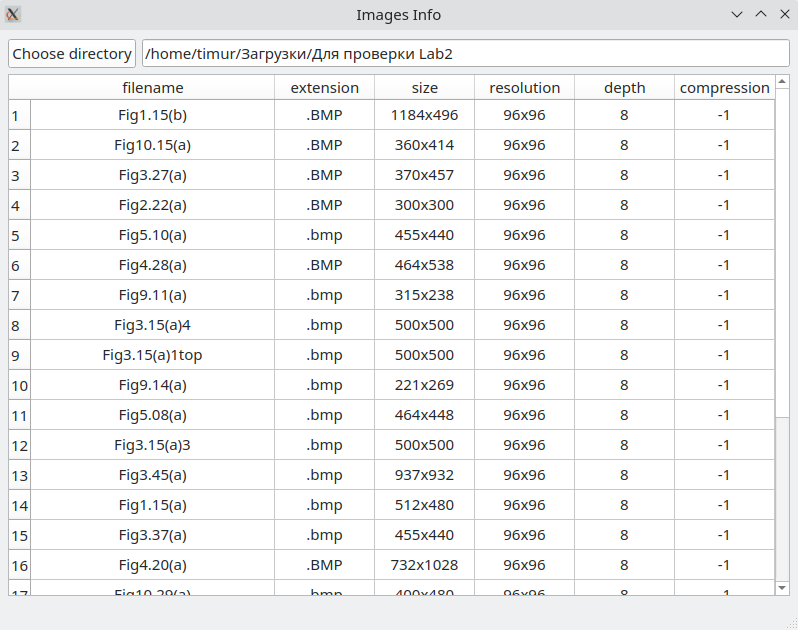

# Images Info

## Overview

This is the application to get basic image meta-info.



## Requirements

* Compiler with `C++17` support
* `boost 1.44` or higher
* `Qt5`

## Building

First, you need download `qmake`. For example by using the following commands:

```shell
sudo apt install qt5-qmake
sudo apt install qt5base-dev
```

Creating build directory:
```shell
mkdir build
cd build
```

Building application

```shell
qmake ..
make
```

#### For Windows systems
```shell
qmake -tp vc ..
```
And then you need to build _.sln_ file with `msbuild` or `Visual Studio`.

If you have `Qt Creator` application, you can simply open this project (by opening _.pro_ file) and build it.

## Usage

The color picker is represented in `flow::qwidgets::images_info` class (inherited from `QMainWindow`).

The code shows the simplest way to use `flow::qwidgets::images_info` class:

```c++
#include <QApplication>
#include <flow/qwidgets/images_info.hpp>

int main(int argc, char *argv[]) {
    QApplication a(argc, argv);

    flow::qwidgets::images_info images_info;
    images_info.show();

    return QApplication::exec();
}
```
